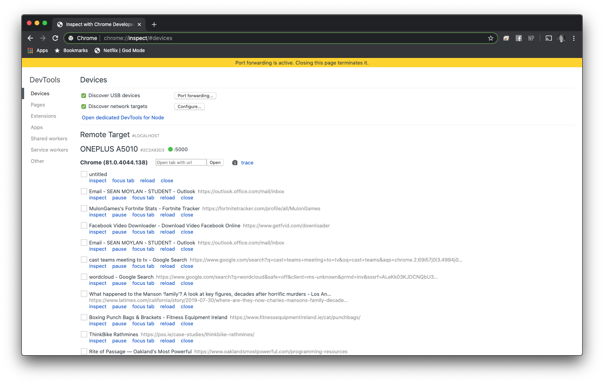
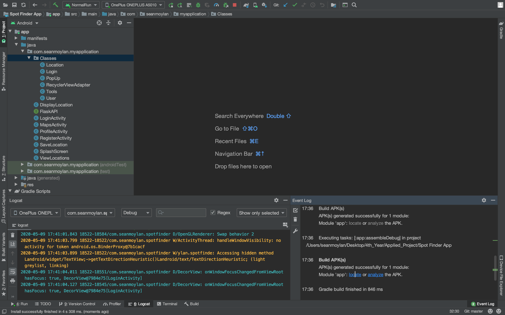

# Overview 
Spot Finder is an Android Application designed to help skaters locate popular spots around the globe that they can skate at. From a city plaza to a stair set located behind a rural building, this app is made to help the skater locate areas for them to skate. This means if someone was to travel to a new country/city they would be able to easily locate areas that local skaters have saved on the app without having to painfully search around massive areas for a certain type of spot they are looking for e.g skatepark, outdoor skatepark, stair set, hand rail, plaza etc.

For a short screencast preview of this app working, navigate to the folder `Screencast` where you will find a short 2 minute video:

1. Creating a User
2. Showing the locations from the database
3. Displaying the details of different locations
4. Showing how to get directions to a given location
5. Saving a new location
6. Closing the app and signing into another user
7. Viewing the location saved by the first user
8. Viewing different locations from the List and displaying them on the map seperate to others
9. End of preview

## Details

| Project Details   |     |
| --- | --- |
| **Course** | BSc (Hons) in Software Development  |
| **Module** |  Applied Project and Minor Dissertation |
| **College** | [Galway-Mayo Institute of Technology](http://www.gmit.ie/) Galway |
| **Students** | Sean Moylan & Shane Moran |
| **Project Supervisor** | Martin Kenirons |
| **Module Supervisor** | John Healy |
| **Project Title** | Spot Finder Android Application |

## Technologies Used

| Name                                                         | Use                                                          |
| ------------------------------------------------------------ | ------------------------------------------------------------ |
| [Android Studio 3.6.1](https://developer.android.com/studio) | Front end android application development in java 8          |
| [Python3](https://www.python.org/downloads/)                 | Language used to program the Server                          |
| [Flask Server](https://flask.palletsprojects.com/en/1.1.x/)  | A micro web framework written in Python                      |
| [MongoDB 4.2.2](https://www.mongodb.com/)                    | Database for Application                                     |
| [Sublime Text](https://www.sublimetext.com/)                 | Text editor used for coding in python                        |
| [Retrofit](https://square.github.io/retrofit/)               | A HTTP client designed for Android and java                  |
| [jackson](https://github.com/FasterXML/jackson)              | Widly used JSON parser for java                              |
| [JSON](https://en.wikipedia.org/wiki/JSON)                   | File format used for data transfers between database, server and application |
| [MongoDB Compass](https://www.mongodb.com/products/compass)  | A User Interface for use with MongoDB                        |

## Run

Assuming you have all the technologies listed above installed on your device please follow the steps bellow to set up a working environment of this repository on your own machine.

### Android Studio

1. Clone this repo to your device by navigating to your devices terminal and running the following command `git clone <https://github.com/seanmoylan/Applied_Project>`
2. Open Android Studio and click "Open and existing Android Studio project" then navigate the the folder you cloned the repo to.
3. Once inside "Applied_Project"  you will see a folder named "Spot Finder App", select it and give android studio a moment to get everything set up.
4. Done

### Server

1. Clone this repo to your device by navigating to your devices terminal and running the following command `git clone <https://github.com/seanmoylan/Applied_Project>`

2. Open Terminal and navigate to the "Server" directory found in the "Applied_Project" directory

3. Once you are in the Server Directory run the following commands:

4. `export FLASK_APP=FlaskServer.py` this will tell flask what program to run

5. `export FLASK_ENV=development` to run in development mode

6. Finally `flask run` to start the flask server

7. You should now see

    \* Serving Flask app "FlaskServer.py" 

    \* Environment: development

    \* Debug mode: on

    \* Running on http://127.0.0.1:5000/ (Press CTRL+C to quit)

    \* Restarting with stat

    \* Debugger is active!

    \* Debugger PIN: 605-582-474

8. Navigate to a browser of your choice and enter the url above in the address window

9. Now the text "Server is running..." should be displayed

### Database

1. Please visit the site suited to your devise for a full breakdown of how to set up MongoDB
2. [Windows](https://docs.mongodb.com/manual/tutorial/install-mongodb-on-windows/)
3. [Mac](https://docs.mongodb.com/manual/tutorial/install-mongodb-on-os-x/)
4. [Linux](https://docs.mongodb.com/manual/administration/install-on-linux/)
5. Once you have Mongo fully installed on your device, the FlaskServery.py will create a new instance of a database when it is run for the first time.
6. Alternatively you can install MangoDB Compass.
7. Once fully installed click "Fill in connection fields individually" which is displayed under the "New Connection" heading
8. The fields shown should be autofilled to Hostname: `localhost` and Port: `27017` by default
9. Leave authentication as None and select `connect`
10. Select the test database which will appear on the left hand side of the window
11. Now select `Create Collection`
12. You will need to create a collection named "user" and one named "location"
13. Once inside one of the collections select `Add Data` , `Import File` and select either the user.json file or locations.json file and add them to their respective collection.
14. The files needed to populate both collections can be found at` /Server/database_test_data`

## Development Environment

During the development of this Application I would always get everything open on my laptop so I can clearly see what iI am doing. 

1. To start I open Google Chrome on both my Android device and my laptop

2. Type [chrome://inspect/#devices](chrome://inspect/#devices) which gives me a developer tool to alow my mobile device to access my laptops localhost where the server will be running

   

3. On my mobile device I can then enter the address https://localhost:5000 to access the server.

4. Now I open my FlaskServer.py file along with the terminal and start the server

   

5. Lastly I open Android Studio where I can then run the app on my mobile device and observe each step from the UI to the database as they unfold.

   

   

   